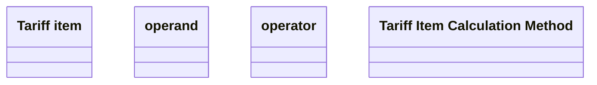

# PCG-2680 Tariff configuration (CBL-11489)

- **Diagram Type**: Logical
- **Package**: HomerSelect/BSL/Requirements Model/Finished/PCG/PCG-2680 Tariff configuration (CBL-11489)
- **Diagram ID**: 138388
- **Elements**: 5
- **Connectors**: 0

