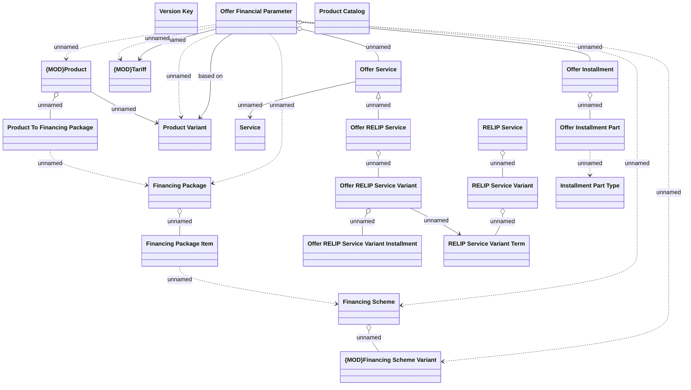

# CBL-1533 Adjust OFP

- **Diagram Type**: Logical
- **Package**: HomerSelect/BSL/Requirements Model/Finished/PCG/PCG-701 Financing Schema II (CBL-1533)
- **Diagram ID**: 105011
- **Elements**: 22
- **Connectors**: 25

