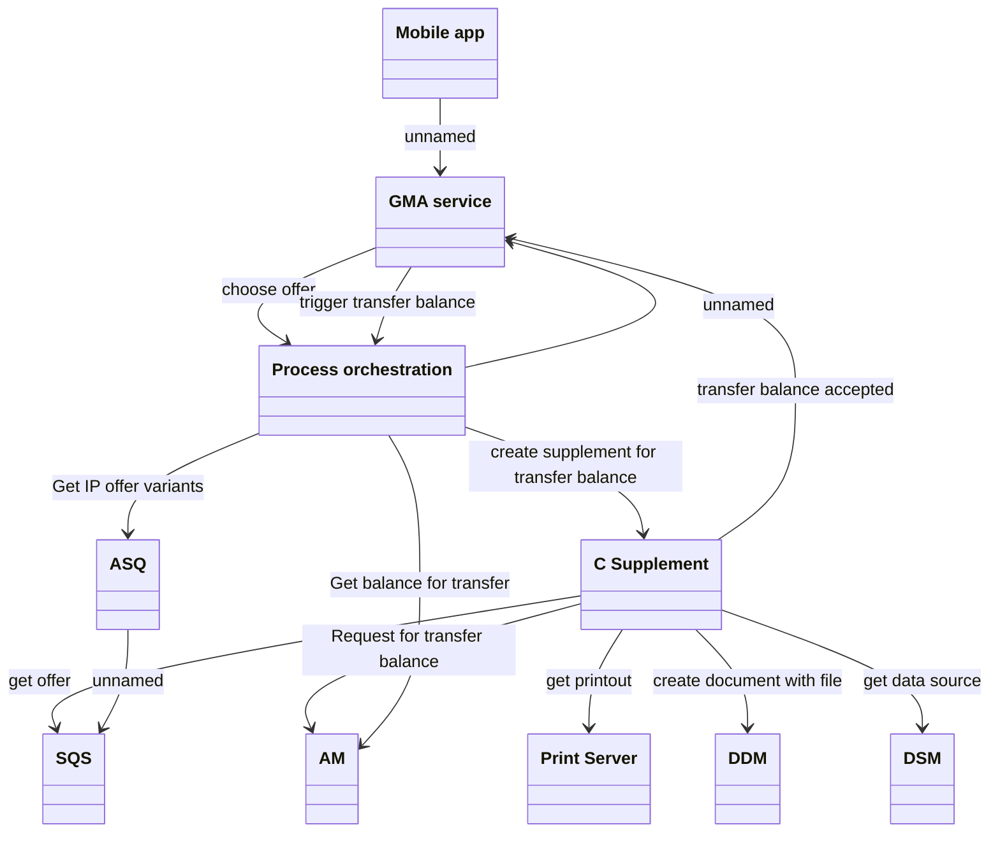

# Transfer balance to IP (IN process version)

```mermaid
classDiagram
    class DSM["DSM"]
    class DDM["DDM"]
    class Print_Server["Print Server"]
    class GMA_service["GMA service"]
    class AM["AM"]
    class C_Supplement["C Supplement"]
    class Mobile_app["Mobile app"]
    class SQS["SQS"]
    class ASQ["ASQ"]
    class Process_orchestration["Process orchestration"]
    GMA_service --> Process_orchestration : choose offer
    GMA_service --> Process_orchestration : trigger transfer balance
    Process_orchestration --> ASQ : Get IP offer variants
    C_Supplement --> SQS : get offer
    ASQ --> SQS : unnamed
    Process_orchestration --> C_Supplement : create supplement for transfer balance
    C_Supplement --> AM : Request for transfer balance
    Process_orchestration --> AM : Get balance for transfer
    C_Supplement --> GMA_service : transfer balance accepted
    Mobile_app --> GMA_service : unnamed
    Process_orchestration --> GMA_service : unnamed
    C_Supplement --> Print_Server : get printout
    C_Supplement --> DDM : create document with file
    C_Supplement --> DSM : get data source
```
