# CBL-26066 (CSI-3652) Add Insurances and Services to Existing Contract in POS Loan and Cash Loan

- **Diagram Type**: Logical
- **Package**: HomerSelect/BSL/Requirements Model/In process/CSI/CBL-26066 (CSI-3652) Add Insurances and Services to Existing Contract in POS Loan and Cash Loan
- **Diagram ID**: 161625
- **Elements**: 10
- **Connectors**: 8

```mermaid
classDiagram
    class MOD_Contract_Management_Global_Parameter["{MOD}Contract Management Global Parameter"]
    class MOD_CreateContractInsurance_validations["{MOD}CreateContractInsurance validations"]
    class MOD_Check_for_an_active_insurance_existence["{MOD}Check for an active insurance existence"]
    class n_08_344_Generate_insurance_offers_for_contract["08.344 Generate insurance offers for contract"]
    class MOD_08_347_Add_Insurance_service_on_Contract_service["{MOD}08.347 Add Insurance service on Contract service"]
    class n_08_348_Calculate_Insurance_offer_parameters["08.348 Calculate Insurance offer parameters"]
    class MOD_08_349_Generate_Insurance_offer_preview["{MOD}08.349 Generate Insurance offer preview"]
    class n_08_340_Show_Insurance_offers_for_loan_contract["08.340 Show Insurance offers for loan contract"]
    class CBL_26066_Add_Insurances_and_Services_to_Existing_Contract_i["CBL-26066 Add Insurances and Services to Existing Contract in POS Loan and Cash Loan"]
    class MOD_08_350_Accept_Contract_Insurance_Service["{MOD}08.350 Accept Contract Insurance Service"]
    MOD_08_347_Add_Insurance_service_on_Contract_service ..> MOD_CreateContractInsurance_validations : unnamed
    MOD_08_347_Add_Insurance_service_on_Contract_service ..> MOD_Check_for_an_active_insurance_existence : unnamed
    MOD_08_349_Generate_Insurance_offer_preview ..> MOD_Check_for_an_active_insurance_existence : unnamed
    n_08_340_Show_Insurance_offers_for_loan_contract ..> MOD_Check_for_an_active_insurance_existence : unnamed
    MOD_08_349_Generate_Insurance_offer_preview --> n_08_348_Calculate_Insurance_offer_parameters : unnamed
    n_08_340_Show_Insurance_offers_for_loan_contract ..> n_08_348_Calculate_Insurance_offer_parameters : unnamed
    n_08_340_Show_Insurance_offers_for_loan_contract --> n_08_344_Generate_insurance_offers_for_contract : unnamed
    MOD_Contract_Management_Global_Parameter ..> n_08_340_Show_Insurance_offers_for_loan_contract : unnamed
```

