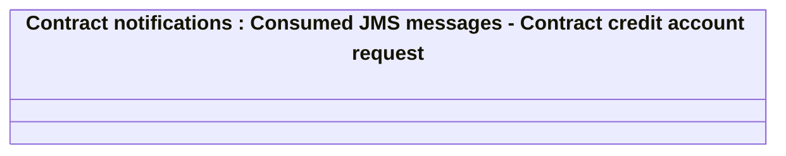

# PAYM-1836 (CBL-4667) - IN JL - Generate IS on basis of JL account opening - interface

- **Diagram Type**: Logical
- **Package**: HomerSelect/BSL/Requirements Model/In process/ISPAY/PAYM-1836 (CBL-4667) - IN JL - Generate IS on basis of JL account opening - interface
- **Diagram ID**: 112569
- **Elements**: 1
- **Connectors**: 0

