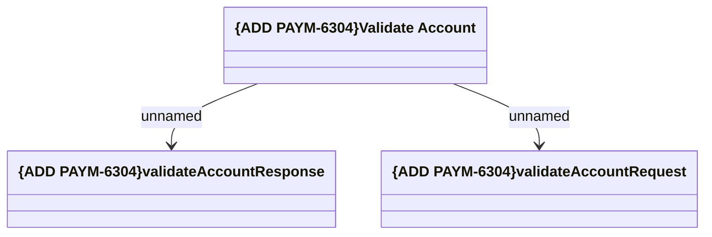

# BITE

- **Diagram Type**: Logical
- **Package**: HomerSelect/BSL/Requirements Model/In process/ISPAY/PAYM-6304 (CBL-31820) Migrate BSL Bank Account Validation from Artajasa Integration to BITE System/BITE
- **Diagram ID**: 164322
- **Elements**: 3
- **Connectors**: 2

