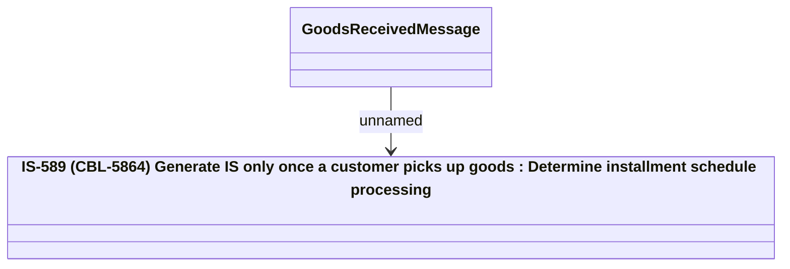

# Goods received

```mermaid
classDiagram
    class IS_589_CBL_5864_Generate_IS_only_once_a_customer_picks_up_go["IS-589 (CBL-5864) Generate IS only once a customer picks up goods : Determine installment schedule processing"]
    class GoodsReceivedMessage["GoodsReceivedMessage"]
    GoodsReceivedMessage --> IS_589_CBL_5864_Generate_IS_only_once_a_customer_picks_up_go : unnamed
```
