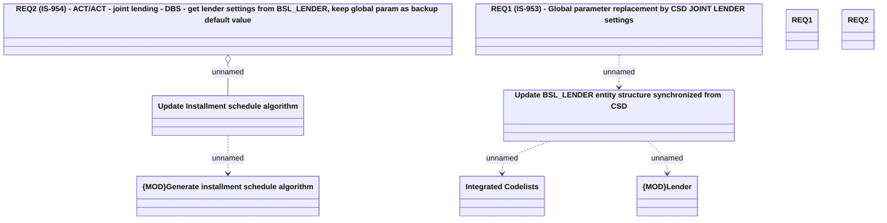

# IS-888 (CBL-10216) Provide support required for 'actual / actual' day count convention for JL tie-up with DBS

- **Diagram Type**: Logical
- **Package**: HomerSelect/BSL/Requirements Model/In process/IS/IS-888 (CBL-10216) Provide support required for 'actual / actual' day count convention for JL tie-up with DBS
- **Diagram ID**: 131153
- **Elements**: 10
- **Connectors**: 5

