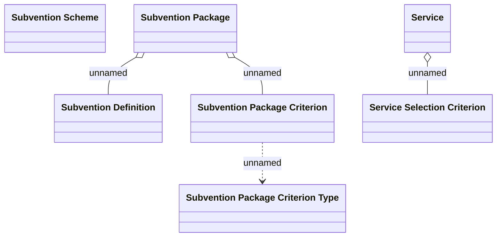

# PCG-5647 BRPH-2755 - Optimizing Subvention Management

- **Diagram Type**: Logical
- **Package**: HomerSelect/BSL/Requirements Model/In process/PCG/PH/PCG-5647 BRPH-2755 - Optimizing Subvention Management
- **Diagram ID**: 164209
- **Elements**: 7
- **Connectors**: 4

