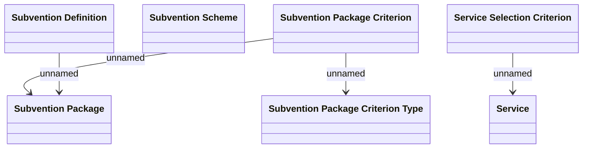

# PCG-5647 BRPH-2755 - Optimizing Subvention Management

```mermaid
classDiagram
    class Subvention_Definition["Subvention Definition"]
    class Subvention_Scheme["Subvention Scheme"]
    class Subvention_Package_Criterion_Type["Subvention Package Criterion Type"]
    class Subvention_Package_Criterion["Subvention Package Criterion"]
    class Service_Selection_Criterion["Service Selection Criterion"]
    class Service["Service"]
    class Subvention_Package["Subvention Package"]
    Subvention_Package_Criterion --> Subvention_Package_Criterion_Type : unnamed
    Service_Selection_Criterion --> Service : unnamed
    Subvention_Package_Criterion --> Subvention_Package : unnamed
    Subvention_Definition --> Subvention_Package : unnamed
```
