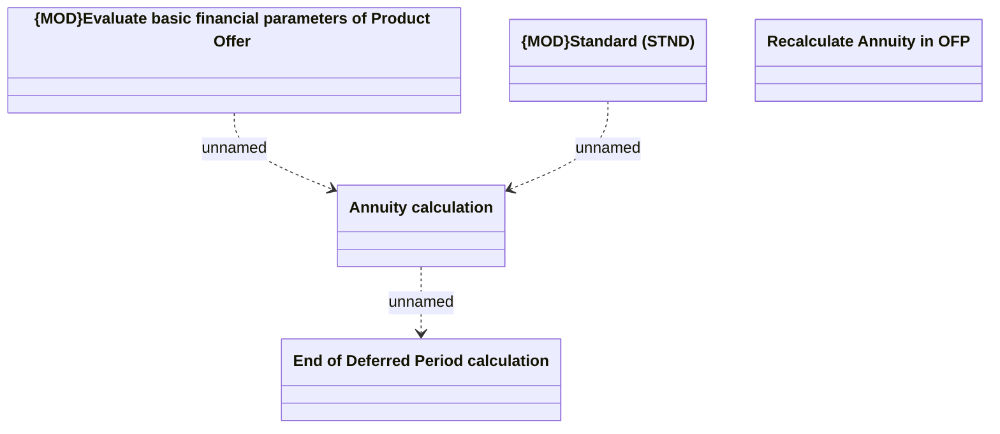

# Various things

- **Diagram Type**: Logical
- **Package**: HomerSelect/BSL/Requirements Model/In process/PCG/Various things
- **Diagram ID**: 163164
- **Elements**: 5
- **Connectors**: 3

```mermaid
classDiagram
    class End_of_Deferred_Period_calculation["End of Deferred Period calculation"]
    class MOD_Standard_STND["{MOD}Standard (STND)"]
    class MOD_Evaluate_basic_financial_parameters_of_Product_Offer["{MOD}Evaluate basic financial parameters of Product Offer "]
    class Annuity_calculation["Annuity calculation"]
    class Recalculate_Annuity_in_OFP["Recalculate Annuity in OFP"]
    MOD_Evaluate_basic_financial_parameters_of_Product_Offer ..> Annuity_calculation : unnamed
    Annuity_calculation ..> End_of_Deferred_Period_calculation : unnamed
    MOD_Standard_STND ..> Annuity_calculation : unnamed
```
