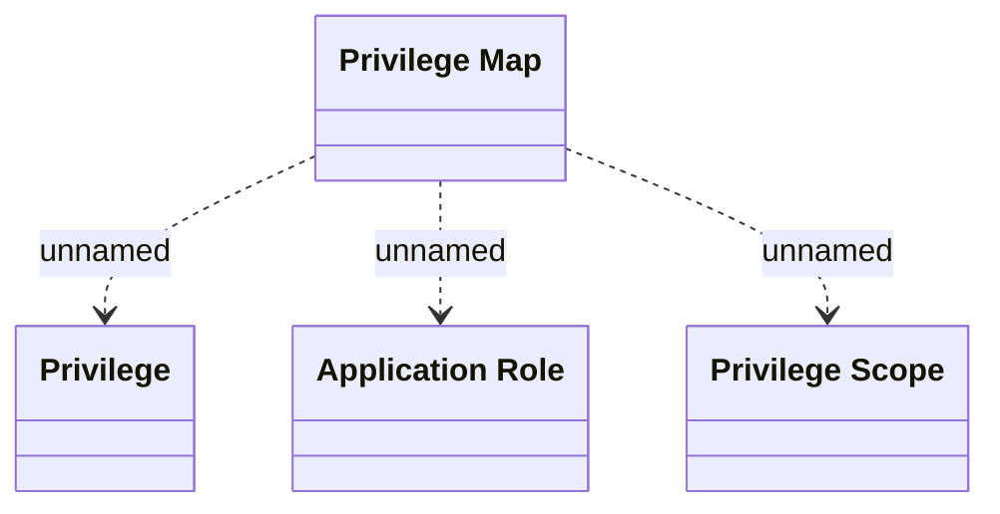

# BSL Privilege Management

- **Diagram Type**: Logical
- **Package**: Model/Work
- **Diagram ID**: 91295
- **Elements**: 4
- **Connectors**: 3

```mermaid
classDiagram
    class Privilege_Scope["Privilege Scope"]
    class Privilege["Privilege"]
    class Privilege_Map["Privilege Map"]
    class Application_Role["Application Role"]
    Privilege_Map ..> Privilege : unnamed
    Privilege_Map ..> Application_Role : unnamed
    Privilege_Map ..> Privilege_Scope : unnamed
```
