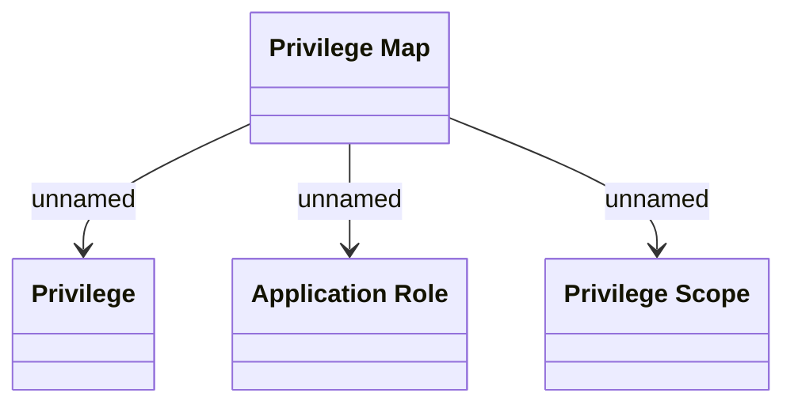

# BSL Privilege Management

```mermaid
classDiagram
    class Application_Role["Application Role"]
    class Privilege_Map["Privilege Map"]
    class Privilege["Privilege"]
    class Privilege_Scope["Privilege Scope"]
    Privilege_Map --> Privilege : unnamed
    Privilege_Map --> Application_Role : unnamed
    Privilege_Map --> Privilege_Scope : unnamed
```
