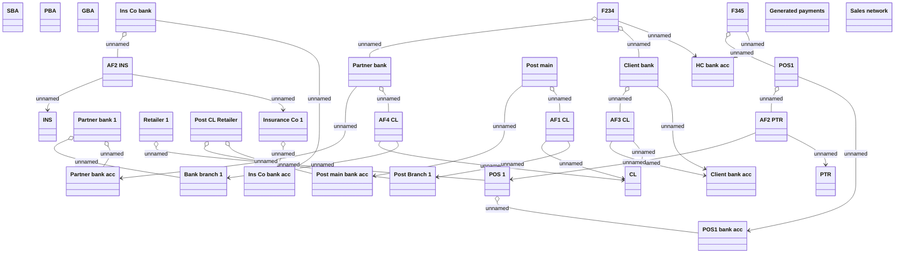

# Payment orders model

- **Diagram Type**: Object
- **Package**: HomerSelect/BSL/Analysis Model/Payments/Outgoing payments/COMMON for Outgoing Payments/Logical Data Model/Payment generation model
- **Diagram ID**: 104393
- **Elements**: 33
- **Connectors**: 32

