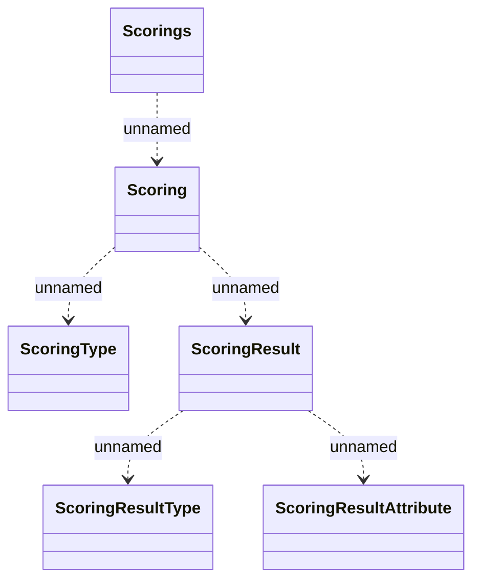

# Scoring

- **Diagram Type**: Object
- **Package**: HomerSelect/BSL/Analysis Model/_Interface/Provided Web Services/Scoring
- **Diagram ID**: 155825
- **Elements**: 6
- **Connectors**: 5

```mermaid
classDiagram
    class ScoringType["ScoringType"]
    class ScoringResultType["ScoringResultType"]
    class Scorings["Scorings"]
    class ScoringResultAttribute["ScoringResultAttribute"]
    class ScoringResult["ScoringResult"]
    class Scoring["Scoring"]
    Scoring ..> ScoringResult : unnamed
    Scoring ..> ScoringType : unnamed
    ScoringResult ..> ScoringResultType : unnamed
    ScoringResult ..> ScoringResultAttribute : unnamed
    Scorings ..> Scoring : unnamed
```
