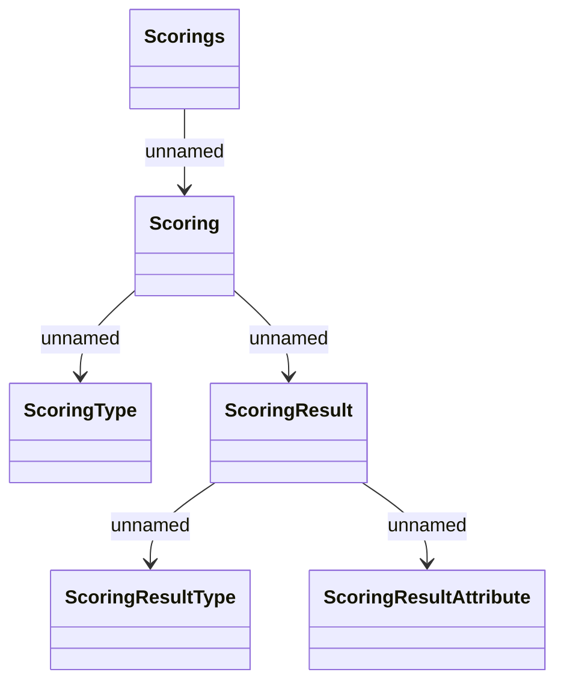

# Scoring

```mermaid
classDiagram
    class ScoringType["ScoringType"]
    class ScoringResultType["ScoringResultType"]
    class Scorings["Scorings"]
    class ScoringResultAttribute["ScoringResultAttribute"]
    class ScoringResult["ScoringResult"]
    class Scoring["Scoring"]
    Scoring --> ScoringResult : unnamed
    Scoring --> ScoringType : unnamed
    ScoringResult --> ScoringResultType : unnamed
    ScoringResult --> ScoringResultAttribute : unnamed
    Scorings --> Scoring : unnamed
```
