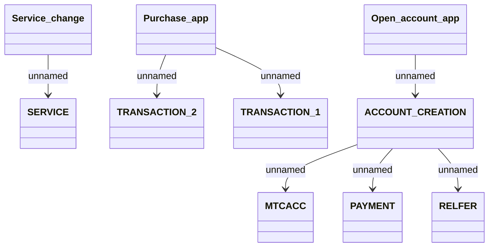

# ACCOUNT_CREATION Sales Quote mapping

```mermaid
classDiagram
    class SERVICE["SERVICE"]
    class Service_change["Service_change"]
    class TRANSACTION_2["TRANSACTION_2"]
    class Purchase_app["Purchase_app"]
    class TRANSACTION_1["TRANSACTION_1"]
    class Open_account_app["Open_account_app"]
    class RELFER["RELFER"]
    class PAYMENT["PAYMENT"]
    class MTCACC["MTCACC"]
    class ACCOUNT_CREATION["ACCOUNT_CREATION"]
    Purchase_app --> TRANSACTION_1 : unnamed
    Open_account_app --> ACCOUNT_CREATION : unnamed
    ACCOUNT_CREATION --> MTCACC : unnamed
    ACCOUNT_CREATION --> PAYMENT : unnamed
    ACCOUNT_CREATION --> RELFER : unnamed
    Service_change --> SERVICE : unnamed
    Purchase_app --> TRANSACTION_2 : unnamed
```
