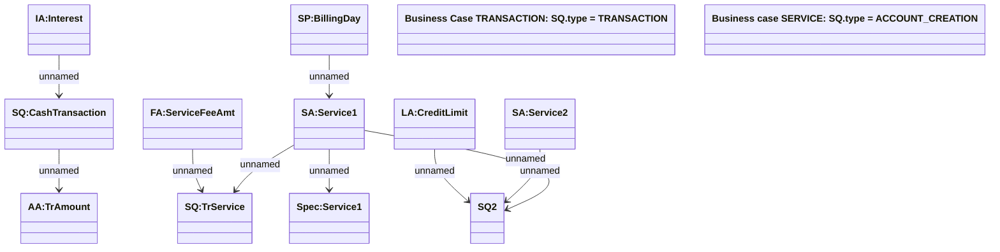

# Sales Quote structure (OM)

- **Diagram Type**: Object
- **Package**: HomerSelect/BSL/Modules/Supplements (SUP_NG)/Analytical Model/Contract Supplements/Sales Quote processing/Sales Quote structure (OM)
- **Diagram ID**: 160445
- **Elements**: 14
- **Connectors**: 9

