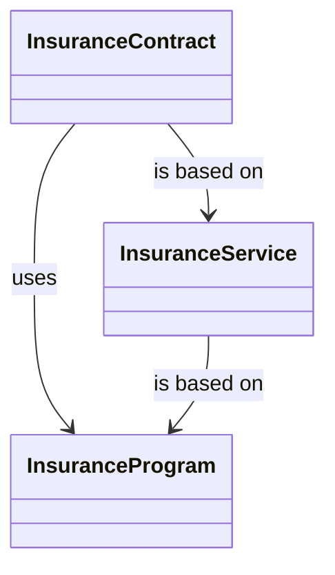

# VAS relationships

- **Diagram Type**: Object
- **Package**: HomerSelect/BSL/Modules/Value Added Services (VAS)/Analytical Model/COMMON for VAS/VAS relationships
- **Diagram ID**: 147480
- **Elements**: 3
- **Connectors**: 3

