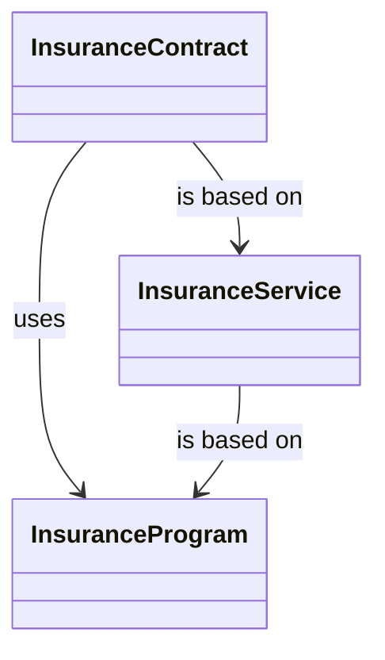

# VAS relationships

```mermaid
classDiagram
    class InsuranceService["InsuranceService"]
    class InsuranceContract["InsuranceContract"]
    class InsuranceProgram["InsuranceProgram"]
    InsuranceContract --> InsuranceService : is based on
    InsuranceContract --> InsuranceProgram : uses
    InsuranceService --> InsuranceProgram : is based on
```
