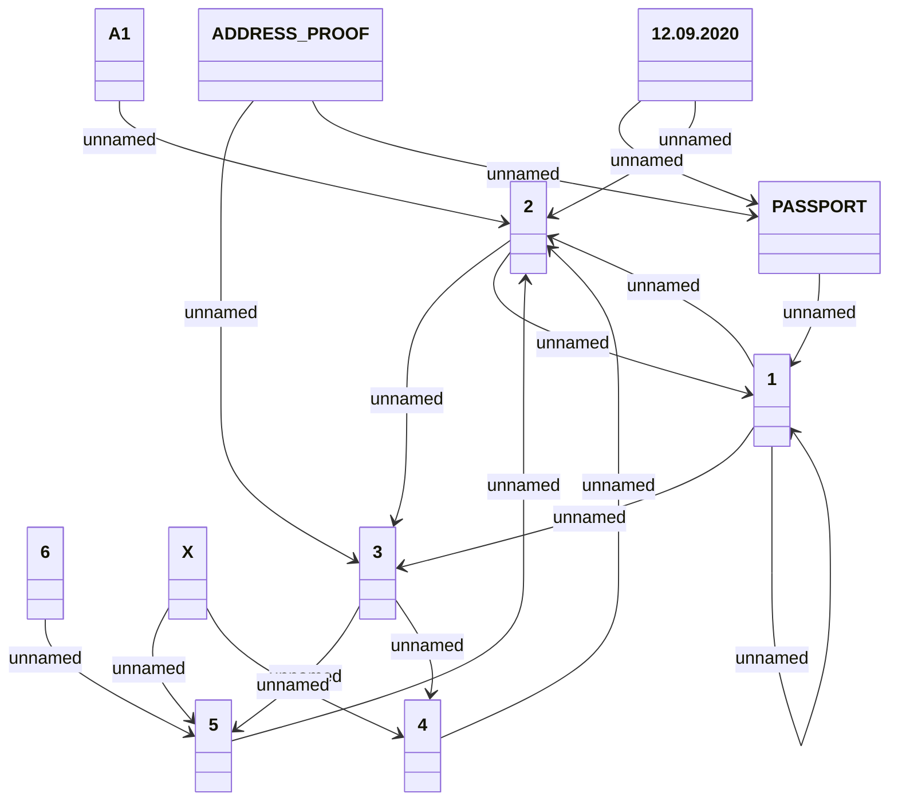

# object

```mermaid
classDiagram
    class A1["A1"]
    class n_12_09_2020["12.09.2020"]
    class ADDRESS_PROOF["ADDRESS_PROOF"]
    class PASSPORT["PASSPORT"]
    class n_6["6"]
    class X["X"]
    class n_3["3"]
    class n_5["5"]
    class n_4["4"]
    class n_2["2"]
    class n_2["2"]
    class n_3["3"]
    class n_1["1"]
    class n_2["2"]
    class n_1["1"]
    class n_1["1"]
    ADDRESS_PROOF --> n_3 : unnamed
    ADDRESS_PROOF --> PASSPORT : unnamed
    X --> n_5 : unnamed
    n_6 --> n_5 : unnamed
    n_3 --> n_5 : unnamed
    n_3 --> n_4 : unnamed
    X --> n_4 : unnamed
    n_5 --> n_2 : unnamed
    n_12_09_2020 --> PASSPORT : unnamed
    A1 --> n_2 : unnamed
    PASSPORT --> n_1 : unnamed
    n_2 --> n_3 : unnamed
    n_1 --> n_3 : unnamed
    n_1 --> n_2 : unnamed
    n_12_09_2020 --> n_2 : unnamed
    n_2 --> n_1 : unnamed
    n_1 --> n_1 : unnamed
    n_1 --> n_1 : unnamed
    n_4 --> n_2 : unnamed
```
