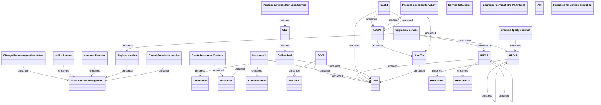

# Service concept (object model)

```mermaid
classDiagram
    class AlopTrx["AlopTrx"]
    class Change_Serivce_operation_status["Change Serivce operation status"]
    class Add_a_Service["Add a Service"]
    class Replace_service["Replace service"]
    class Loan_Service_Management["Loan Service Management"]
    class Cancel_Terminate_service["Cancel/Terminate service"]
    class Create_a_3party_contract["Create a 3party contract"]
    class Create_Insurance_Contract["Create Insurance Contract"]
    class Process_a_request_for_Loan_Service["Process a request for Loan Service"]
    class CEL["CEL"]
    class CelService1["CelService1"]
    class CelService["CelService"]
    class Process_a_request_for_ALOP["Process a request for ALOP"]
    class Upgrade_a_Service["Upgrade a Service"]
    class ALOP1["ALOP1"]
    class Cash1["Cash1"]
    class ALOP1["ALOP1"]
    class HBO_2["HBO 2"]
    class HBO_2["HBO 2"]
    class HBO_1["HBO 1"]
    class HBO_1["HBO 1"]
    class Insurance["Insurance"]
    class Insurance1["Insurance1"]
    class Life_Insurance["Life Insurance"]
    class MTCACC["MTCACC"]
    class ACC1["ACC1"]
    class One["One"]
    class HBO_silver["HBO silver"]
    class HBO_bronze["HBO bronze"]
    class Service_Catalogue["Service Catalogue"]
    class Account_Services["Account Services"]
    class Insurance_Contract_3rd_Party_Deal["Insurance Contract (3rd Party Deal)"]
    class AM["AM"]
    class Requests_for_Service_execution["Requests for Service execution"]
    Upgrade_a_Service --> HBO_2 : ADD NEW
    ALOP1 --> AlopTrx : unnamed
    Upgrade_a_Service --> Replace_service : unnamed
    Change_Serivce_operation_status --> Loan_Service_Management : unnamed
    Add_a_Service --> Loan_Service_Management : unnamed
    Account_Services --> Loan_Service_Management : unnamed
    Replace_service --> Loan_Service_Management : unnamed
    Cancel_Terminate_service --> Loan_Service_Management : unnamed
    Process_a_request_for_Loan_Service --> CEL : unnamed
    CEL --> CelService1 : unnamed
    CelService1 --> CelService : unnamed
    Cash1 --> ALOP1 : unnamed
    Process_a_request_for_ALOP --> ALOP1 : unnamed
    Cash1 --> ALOP1 : unnamed
    Process_a_request_for_ALOP --> AlopTrx : unnamed
    ACC1 --> MTCACC : unnamed
    HBO_2 --> HBO_silver : unnamed
    ACC1 --> One : unnamed
    Insurance1 --> One : unnamed
    HBO_1 --> One : unnamed
    Cash1 --> One : unnamed
    HBO_2 --> HBO_2 : unnamed
    CelService1 --> One : unnamed
    Create_a_3party_contract --> HBO_2 : unnamed
    Insurance1 --> Life_Insurance : unnamed
    Create_Insurance_Contract --> Insurance : unnamed
    Insurance1 --> Insurance : unnamed
    Upgrade_a_Service --> HBO_1 : TERMINATE
    HBO_1 --> HBO_1 : unnamed
    HBO_1 --> HBO_bronze : unnamed
    AlopTrx --> One : unnamed
```
