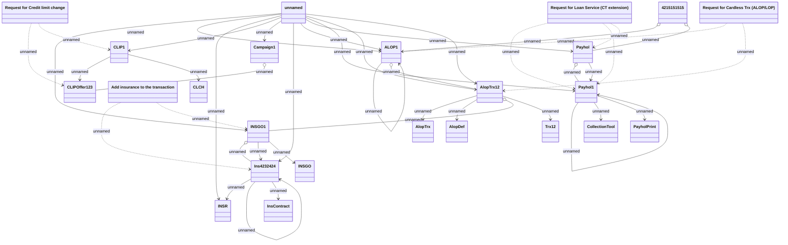

# Service concept - Loan Service Requests (object model)

- **Diagram Type**: Object
- **Package**: HomerSelect/BSL/Requirements Model/Finished/CSI/CBL-16152 (CSI-1340) Contract service modularization - analysis/Service concept (object model)
- **Diagram ID**: 151174
- **Elements**: 35
- **Connectors**: 42

