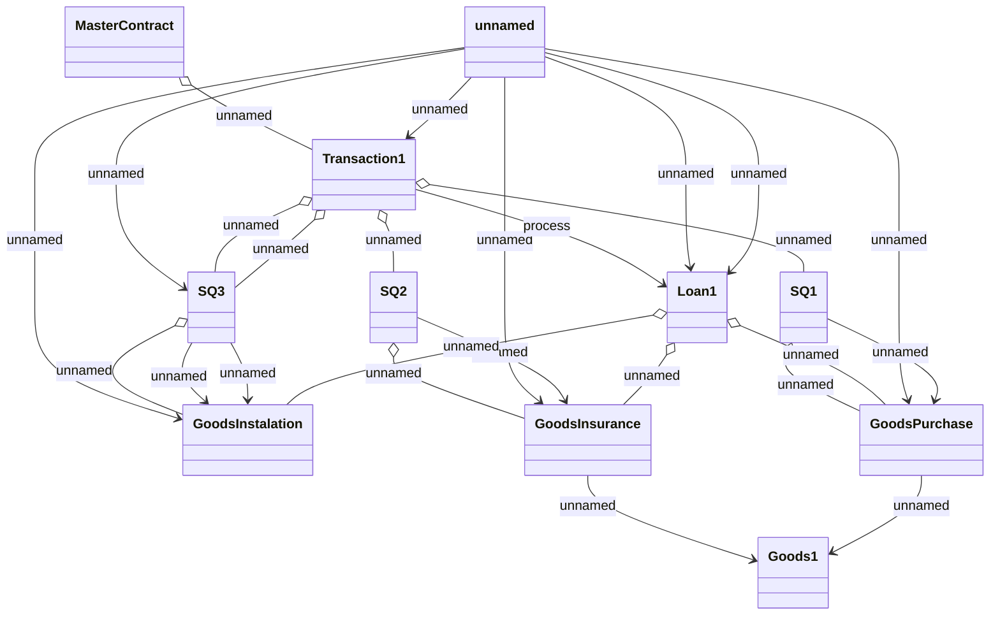

# VAS object model

- **Diagram Type**: Object
- **Package**: HomerSelect/BSL/Requirements Model/Finished/CSI/CBL-16736 (CSI-1550) EMI Card - VAS as a service -Termination/VAS object model
- **Diagram ID**: 151944
- **Elements**: 21
- **Connectors**: 25

