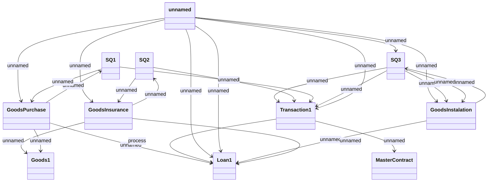

# VAS object model

```mermaid
classDiagram
    class MasterContract["MasterContract"]
    class Goods1["Goods1"]
    class SQ3["SQ3"]
    class SQ2["SQ2"]
    class SQ1["SQ1"]
    class SQ3["SQ3"]
    class GoodsInstalation["GoodsInstalation"]
    class GoodsInsurance["GoodsInsurance"]
    class GoodsPurchase["GoodsPurchase"]
    class Transaction1["Transaction1"]
    class GoodsInstalation["GoodsInstalation"]
    class GoodsInsurance["GoodsInsurance"]
    class GoodsPurchase["GoodsPurchase"]
    class Loan1["Loan1"]
    unnamed --> GoodsInstalation : unnamed
    GoodsInsurance --> Goods1 : unnamed
    GoodsPurchase --> Goods1 : unnamed
    GoodsInstalation --> SQ3 : unnamed
    GoodsInsurance --> SQ2 : unnamed
    GoodsPurchase --> SQ1 : unnamed
    unnamed --> SQ3 : unnamed
    SQ3 --> GoodsInstalation : unnamed
    SQ3 --> Transaction1 : unnamed
    SQ2 --> Transaction1 : unnamed
    SQ1 --> Transaction1 : unnamed
    Transaction1 --> MasterContract : unnamed
    SQ3 --> Transaction1 : unnamed
    GoodsPurchase --> Loan1 : unnamed
    SQ3 --> GoodsInstalation : unnamed
    unnamed --> GoodsInsurance : unnamed
    SQ2 --> GoodsInsurance : unnamed
    unnamed --> GoodsPurchase : unnamed
    SQ1 --> GoodsPurchase : unnamed
    Transaction1 --> Loan1 : process
    unnamed --> Loan1 : unnamed
    unnamed --> Loan1 : unnamed
    GoodsInstalation --> Loan1 : unnamed
    GoodsInsurance --> Loan1 : unnamed
    unnamed --> Transaction1 : unnamed
```
