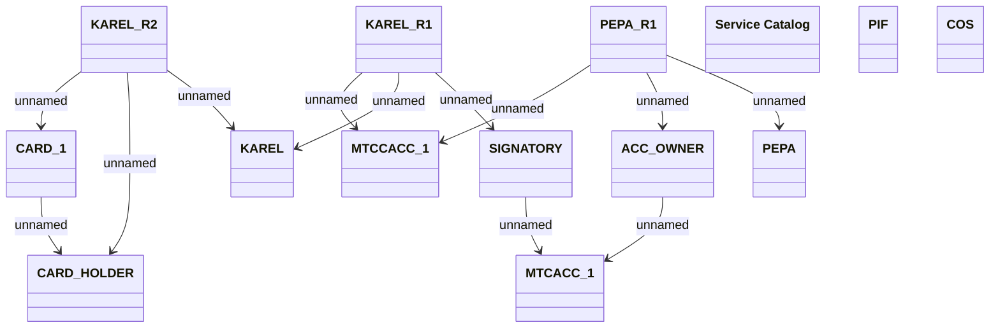

# SME Object Model

```mermaid
classDiagram
    class CARD_1["CARD_1"]
    class CARD_HOLDER["CARD_HOLDER"]
    class KAREL_R2["KAREL_R2"]
    class CARD_1["CARD_1"]
    class KAREL["KAREL"]
    class KAREL_R1["KAREL_R1"]
    class PEPA["PEPA"]
    class PEPA_R1["PEPA_R1"]
    class MTCCACC_1["MTCCACC_1"]
    class SIGNATORY["SIGNATORY"]
    class ACC_OWNER["ACC_OWNER"]
    class MTCACC_1["MTCACC_1"]
    class Service_Catalog["Service Catalog"]
    class PIF["PIF"]
    class COS["COS"]
    ACC_OWNER --> MTCACC_1 : unnamed
    SIGNATORY --> MTCACC_1 : unnamed
    PEPA_R1 --> MTCCACC_1 : unnamed
    PEPA_R1 --> ACC_OWNER : unnamed
    PEPA_R1 --> PEPA : unnamed
    KAREL_R1 --> MTCCACC_1 : unnamed
    KAREL_R1 --> KAREL : unnamed
    KAREL_R1 --> SIGNATORY : unnamed
    KAREL_R2 --> CARD_1 : unnamed
    KAREL_R2 --> CARD_HOLDER : unnamed
    KAREL_R2 --> KAREL : unnamed
    CARD_1 --> CARD_HOLDER : unnamed
```
