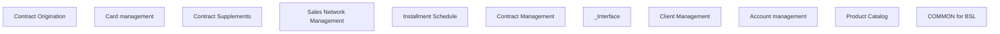

# BSL package overview

- **Diagram Type**: Package
- **Package**: HomerSelect/BSL/Analysis Model
- **Diagram ID**: 142415
- **Elements**: 11
- **Connectors**: 0

```mermaid
graph TD
    Contract_Origination["Contract Origination"]
    Card_management["Card management"]
    Contract_Supplements["Contract Supplements"]
    Sales_Network_Management["Sales Network Management"]
    Installment_Schedule["Installment Schedule"]
    Contract_Management["Contract Management"]
    Interface["_Interface"]
    Client_Management["Client Management"]
    Account_management["Account management"]
    Product_Catalog["Product Catalog"]
    COMMON_for_BSL["COMMON for BSL"]
```
