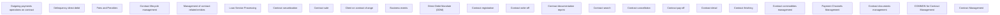

# Contract Management overview

- **Diagram Type**: Package
- **Package**: HomerSelect/BSL/Analysis Model/Contract Management
- **Diagram ID**: 159829
- **Elements**: 24
- **Connectors**: 0

```mermaid
graph TD
    Outgoing_payments_operations_on_contract["Outgoing payments operations on contract"]
    Delinquency_direct_debit["Delinquency direct debit"]
    Fees_and_Penalties["Fees and Penalties"]
    Contract_lifecycle_management["Contract lifecycle management"]
    Management_of_contract_related_entities["Management of contract-related entities"]
    Loan_Service_Processing["Loan Service Processing"]
    Contract_securitization["Contract securitization"]
    Contract_sale["Contract sale"]
    Client_on_contract_change["Client on contract change"]
    Business_events["Business events"]
    Direct_Debit_Mandate_DDM["Direct Debit Mandate (DDM)"]
    Contract_registration["Contract registration"]
    Contract_write_off["Contract write-off"]
    Contract_documentation_reprint["Contract documentation reprint"]
    Contract_search["Contract search"]
    Contract_cancellation["Contract cancellation"]
    Contract_pay_off["Contract pay-off"]
    Contract_detail["Contract detail"]
    Contract_finishing["Contract finishing"]
    Contract_commodities_management["Contract commodities management"]
    Payment_Channels_Management["Payment Channels Management"]
    Contract_documents_management["Contract documents management"]
    COMMON_for_Contract_Management["COMMON for Contract Management"]
    Contract_Management["Contract Management"]
```
