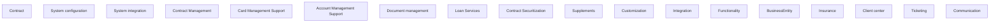

# CLM

```mermaid
graph TD
    Contract["Contract"]
    System_configuration["System configuration"]
    System_integration["System integration"]
    Contract_Management["Contract Management"]
    Card_Management_Support["Card Management Support"]
    Account_Management_Support["Account Management Support"]
    Document_management["Document management"]
    Loan_Services["Loan Services"]
    Contract_Securitization["Contract Securitization"]
    Supplements["Supplements"]
    Customization["Customization"]
    Integration["Integration"]
    Functionality["Functionality"]
    BusinessEntity["BusinessEntity"]
    Insurance["Insurance"]
    Client_center["Client center"]
    Ticketing["Ticketing"]
    Communication["Communication"]
```
