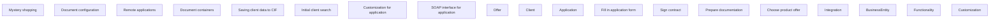

# LOR

- **Diagram Type**: Package
- **Package**: HomerSelect/BSL/Feature Guide/LOR
- **Diagram ID**: 119056
- **Elements**: 19
- **Connectors**: 0

```mermaid
graph TD
    Mystery_shopping["Mystery shopping"]
    Document_configuration["Document configuration"]
    Remote_applications["Remote applications"]
    Document_containers["Document containers"]
    Saving_client_data_to_CIF["Saving client data to CIF"]
    Initial_client_search["Initial client search"]
    Customization_for_application["Customization for application"]
    SOAP_interface_for_application["SOAP interface for application"]
    Offer["Offer"]
    Client["Client"]
    Application["Application"]
    Fill_in_application_form["Fill in application form"]
    Sign_contract["Sign contract"]
    Prepare_documentation["Prepare documentation"]
    Choose_product_offer["Choose product offer"]
    Integration["Integration"]
    BusinessEntity["BusinessEntity"]
    Functionality["Functionality"]
    Customization["Customization"]
```
