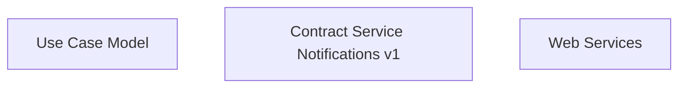

# Contract Services (COS_NG) overview

- **Diagram Type**: Package
- **Package**: HomerSelect/BSL/Modules/Contract Services (COS_NG)
- **Diagram ID**: 163371
- **Elements**: 3
- **Connectors**: 0

```mermaid
graph TD
    Use_Case_Model["Use Case Model"]
    Contract_Service_Notifications_v1["Contract Service Notifications v1"]
    Web_Services["Web Services"]
```
