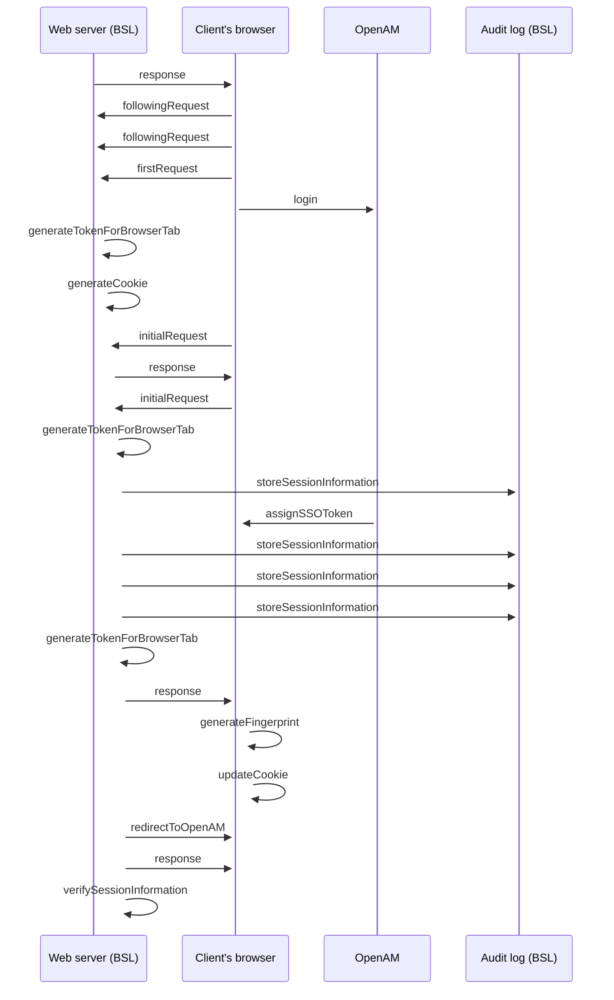

# Sequence diagram: Tracking of requests from user's browser

- **Diagram Type**: Sequence
- **Package**: HomerSelect/BSL/Analysis Model/COMMON for BSL/Tracking of requests from user's browser/Business Rules
- **Diagram ID**: 63475
- **Elements**: 9
- **Connectors**: 23

