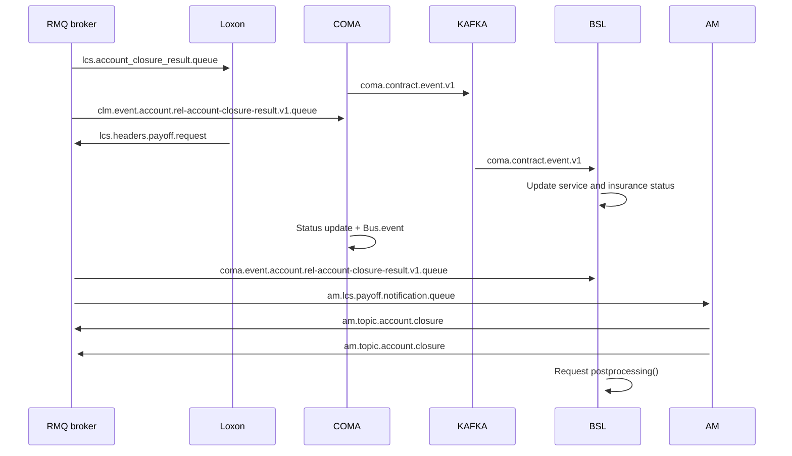

# Pay-off REL Operation diagram

- **Diagram Type**: Sequence
- **Package**: HomerSelect/BSL/Analysis Model/Contract Management/Contract pay-off/UseCase Model/Pay-off REL Operation diagram
- **Diagram ID**: 160825
- **Elements**: 6
- **Connectors**: 12

