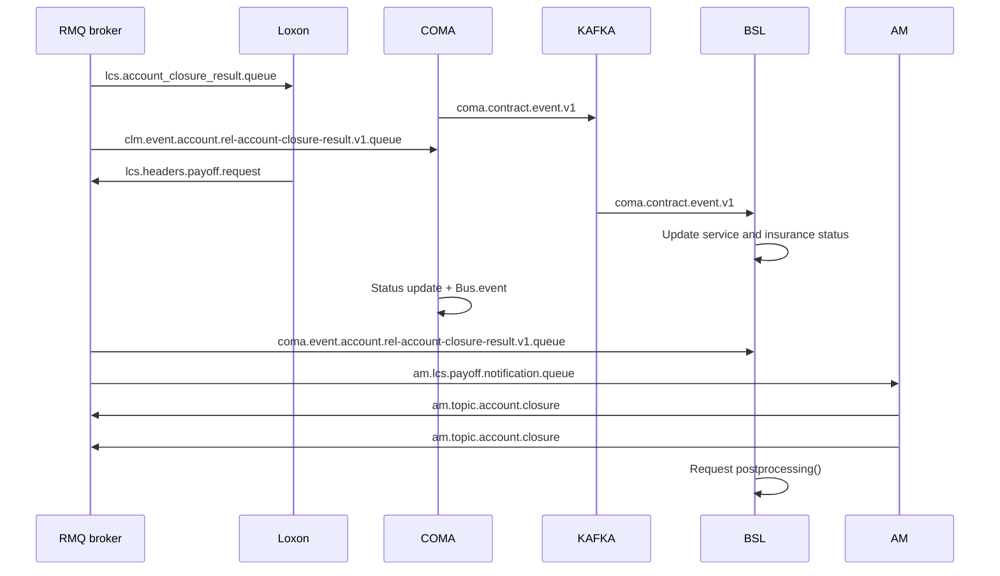

# Pay-off REL Operation diagram

```mermaid
sequenceDiagram
    participant RMQ_broker as RMQ broker
    participant Loxon as Loxon
    participant COMA as COMA
    participant KAFKA as KAFKA
    participant BSL as BSL
    participant AM as AM
    RMQ_broker->>Loxon: lcs.account_closure_result.queue
    COMA->>KAFKA: coma.contract.event.v1
    RMQ_broker->>COMA: clm.event.account.rel-account-closure-result.v1.queue
    Loxon->>RMQ_broker: lcs.headers.payoff.request
    KAFKA->>BSL: coma.contract.event.v1
    BSL->>BSL: Update service and insurance status
    COMA->>COMA: Status update + Bus.event
    RMQ_broker->>BSL: coma.event.account.rel-account-closure-result.v1.queue
    RMQ_broker->>AM: am.lcs.payoff.notification.queue
    AM->>RMQ_broker: am.topic.account.closure
    AM->>RMQ_broker: am.topic.account.closure
    BSL->>BSL: Request postprocessing()
```
