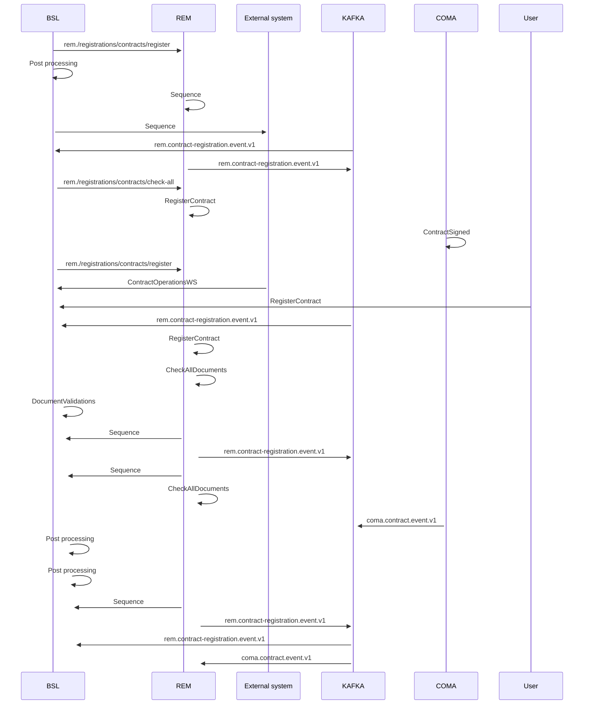

# Contract Registration operation diagram

- **Diagram Type**: Sequence
- **Package**: HomerSelect/BSL/Analysis Model/Contract Management/Contract registration/UseCase Model/Contract Registration operation diagram
- **Diagram ID**: 160871
- **Elements**: 9
- **Connectors**: 27

