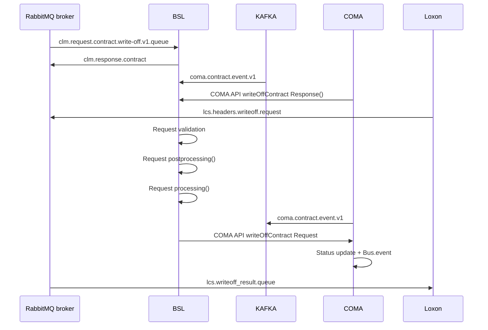

# Write-off CEL Operation diagram

```mermaid
sequenceDiagram
    participant RabbitMQ_broker as RabbitMQ broker
    participant BSL as BSL
    participant KAFKA as KAFKA
    participant COMA as COMA
    participant Loxon as Loxon
    RabbitMQ_broker->>BSL: clm.request.contract.write-off.v1.queue
    BSL->>RabbitMQ_broker: clm.response.contract
    KAFKA->>BSL: coma.contract.event.v1
    COMA->>BSL: COMA API writeOffContract Response()
    Loxon->>RabbitMQ_broker: lcs.headers.writeoff.request
    BSL->>BSL: Request validation
    BSL->>BSL: Request postprocessing()
    BSL->>BSL: Request processing()
    COMA->>KAFKA: coma.contract.event.v1
    BSL->>COMA: COMA API writeOffContract Request
    COMA->>COMA: Status update + Bus.event
    RabbitMQ_broker->>Loxon: lcs.writeoff_result.queue
```
