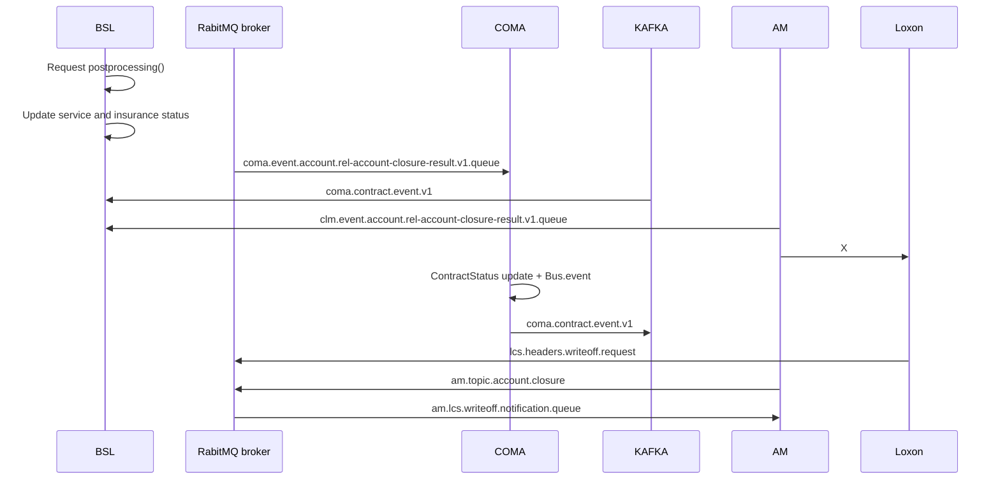

# Write-off REL Operation diagram

```mermaid
sequenceDiagram
    participant BSL as BSL
    participant RabitMQ_broker as RabitMQ broker
    participant COMA as COMA
    participant KAFKA as KAFKA
    participant AM as AM
    participant Loxon as Loxon
    BSL->>BSL: Request postprocessing()
    BSL->>BSL: Update service and insurance status
    RabitMQ_broker->>COMA: coma.event.account.rel-account-closure-result.v1.queue
    KAFKA->>BSL: coma.contract.event.v1
    AM->>BSL: clm.event.account.rel-account-closure-result.v1.queue
    AM->>Loxon: X
    COMA->>COMA: ContractStatus update + Bus.event
    COMA->>KAFKA: coma.contract.event.v1
    Loxon->>RabitMQ_broker: lcs.headers.writeoff.request
    AM->>RabitMQ_broker: am.topic.account.closure
    RabitMQ_broker->>AM: am.lcs.writeoff.notification.queue
```
