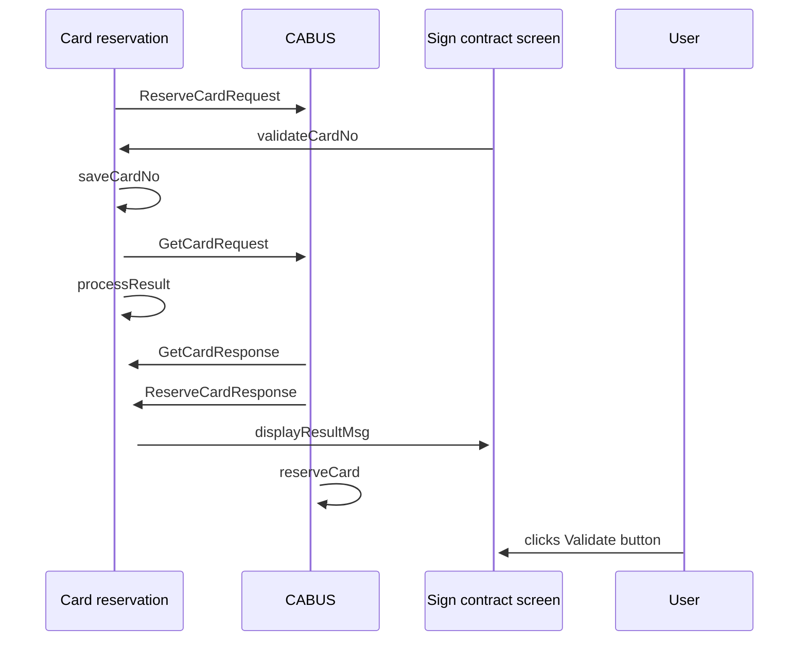

# Validate card number

- **Diagram Type**: Sequence
- **Package**: HomerSelect/BSL/Analysis Model/Contract Origination/Contract signing/UseCase Model
- **Diagram ID**: 164388
- **Elements**: 5
- **Connectors**: 10

