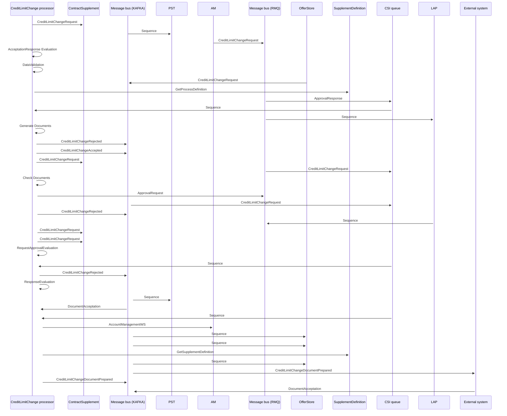

# Credit Limit Change with Doc interaction

- **Diagram Type**: Sequence
- **Package**: HomerSelect/BSL/Analysis Model/Contract Supplements/Credit limit change support/UseCase model/Credit Limit Change with Doc interaction
- **Diagram ID**: 162550
- **Elements**: 16
- **Connectors**: 37

