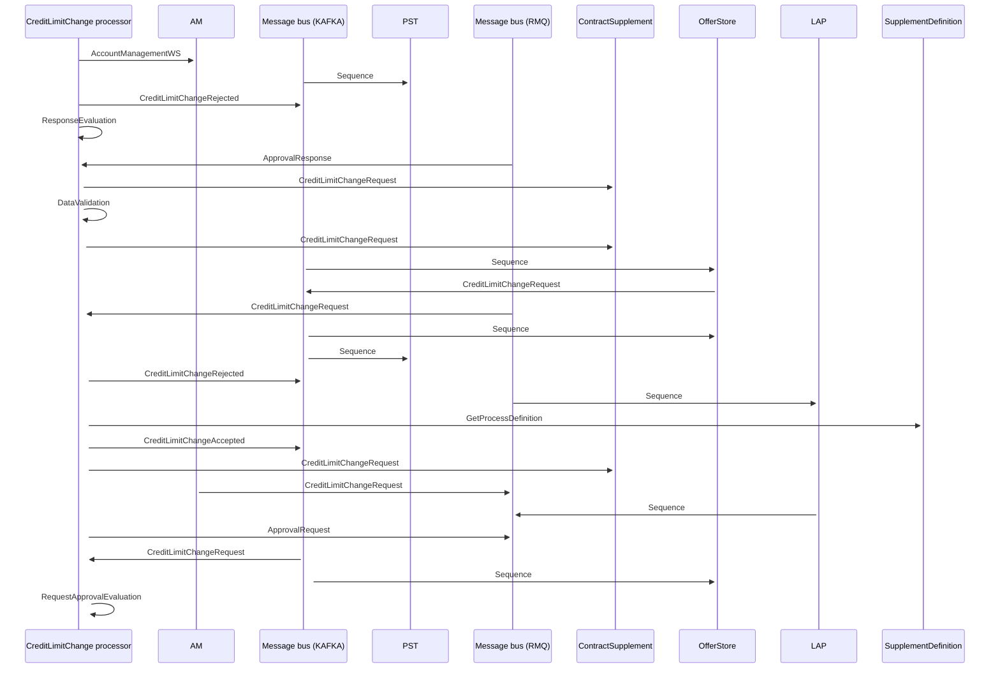

# Credit Limit Change request - messaging

- **Diagram Type**: Sequence
- **Package**: HomerSelect/BSL/Analysis Model/Contract Supplements/Credit limit change support/UseCase model/Credit limit change interaction
- **Diagram ID**: 162743
- **Elements**: 13
- **Connectors**: 24

