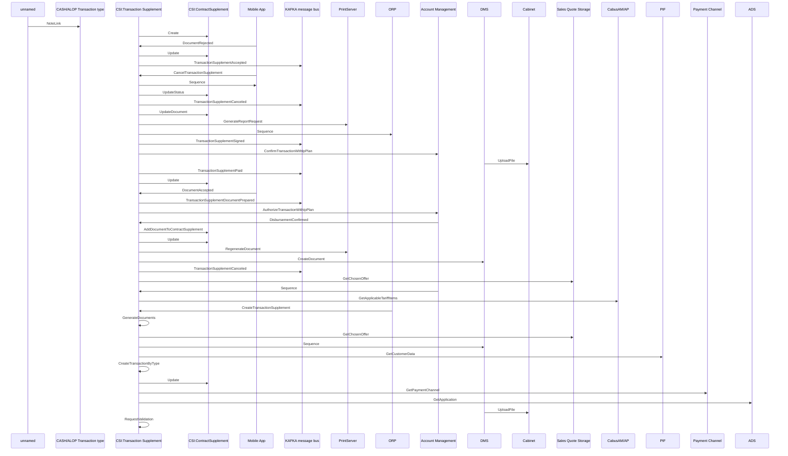

# Transaction Supplement operation diagram

```mermaid
sequenceDiagram
    participant unnamed as unnamed
    participant CASH_ALOP_Transaction_type as CASH/ALOP Transaction type
    participant CSI_Transaction_Supplement as CSI:Transaction Supplement
    participant CSI_ContractSupplement as CSI:ContractSupplement
    participant Mobile_App as Mobile App
    participant KAFKA_message_bus as KAFKA message bus
    participant PrintServer as PrintServer
    participant ORP as ORP
    participant Account_Management as Account Management
    participant DMS as DMS
    participant Cabinet as Cabinet
    participant Sales_Quote_Storage as Sales Quote Storage
    participant CabusAM_AP as CabusAM/AP
    participant PIF as PIF
    participant Payment_Channel as Payment Channel
    participant ADS as ADS
    unnamed->>CASH_ALOP_Transaction_type: NoteLink
    CSI_Transaction_Supplement->>CSI_ContractSupplement: Create
    Mobile_App->>CSI_Transaction_Supplement: DocumentRejected
    CSI_Transaction_Supplement->>CSI_ContractSupplement: Update
    CSI_Transaction_Supplement->>KAFKA_message_bus: TransactionSupplementAccepted
    Mobile_App->>CSI_Transaction_Supplement: CancelTransactionSupplement
    CSI_Transaction_Supplement->>Mobile_App: Sequence
    CSI_Transaction_Supplement->>CSI_ContractSupplement: UpdateStatus
    CSI_Transaction_Supplement->>KAFKA_message_bus: TransactionSupplementCanceled
    CSI_Transaction_Supplement->>CSI_ContractSupplement: UpdateDocument
    CSI_Transaction_Supplement->>PrintServer: GenerateReportRequest
    CSI_Transaction_Supplement->>ORP: Sequence
    CSI_Transaction_Supplement->>KAFKA_message_bus: TransactionSupplementSigned
    CSI_Transaction_Supplement->>Account_Management: ConfirmTransactionWithIpPlan
    DMS->>Cabinet: UploadFile
    CSI_Transaction_Supplement->>KAFKA_message_bus: TransactionSupplementPaid
    CSI_Transaction_Supplement->>CSI_ContractSupplement: Update
    Mobile_App->>CSI_Transaction_Supplement: DocumentAccepted
    CSI_Transaction_Supplement->>KAFKA_message_bus: TransactionSupplementDocumentPrepared
    CSI_Transaction_Supplement->>Account_Management: AuthorizeTransactionWithIpPlan
    Account_Management->>CSI_Transaction_Supplement: DisbursementConfirmed
    CSI_Transaction_Supplement->>CSI_ContractSupplement: AddDocumentToContractSupplement
    CSI_Transaction_Supplement->>CSI_ContractSupplement: Update
    CSI_Transaction_Supplement->>PrintServer: RegenerateDocument
    CSI_Transaction_Supplement->>DMS: CreateDocument
    CSI_Transaction_Supplement->>KAFKA_message_bus: TransactionSupplementCanceled
    CSI_Transaction_Supplement->>Sales_Quote_Storage: GetChosenOffer
    Account_Management->>CSI_Transaction_Supplement: Sequence
    CSI_Transaction_Supplement->>CabusAM_AP: GetApplicableTariffItems
    ORP->>CSI_Transaction_Supplement: CreateTransactionSupplement
    CSI_Transaction_Supplement->>CSI_Transaction_Supplement: GenerateDocuments
    CSI_Transaction_Supplement->>Sales_Quote_Storage: GetChosenOffer
    CSI_Transaction_Supplement->>DMS: Sequence
    CSI_Transaction_Supplement->>PIF: GetCustomerData
    CSI_Transaction_Supplement->>CSI_Transaction_Supplement: CreateTransactionByType
    CSI_Transaction_Supplement->>CSI_ContractSupplement: Update
    CSI_Transaction_Supplement->>Payment_Channel: GetPaymentChannel
    CSI_Transaction_Supplement->>ADS: GetApplication
    DMS->>Cabinet: UploadFile
    CSI_Transaction_Supplement->>CSI_Transaction_Supplement: RequestValidation
```
