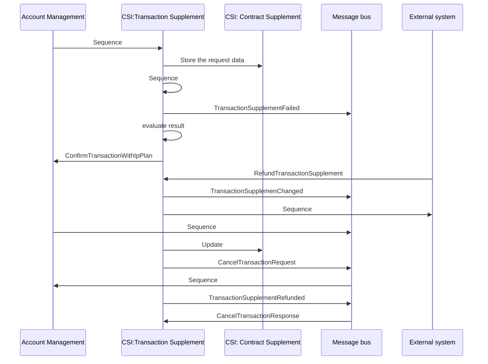

# Transaction Supplement refunding

```mermaid
sequenceDiagram
    participant Account_Management as Account Management
    participant CSI_Transaction_Supplement as CSI:Transaction Supplement
    participant CSI_Contract_Supplement as CSI: Contract Supplement
    participant Message_bus as Message bus
    participant External_system as External system
    participant Message_bus as Message bus
    Account_Management->>CSI_Transaction_Supplement: Sequence
    CSI_Transaction_Supplement->>CSI_Contract_Supplement: Store the request data
    CSI_Transaction_Supplement->>CSI_Transaction_Supplement: Sequence
    CSI_Transaction_Supplement->>Message_bus: TransactionSupplementFailed
    CSI_Transaction_Supplement->>CSI_Transaction_Supplement: evaluate result
    CSI_Transaction_Supplement->>Account_Management: ConfirmTransactionWithIpPlan
    External_system->>CSI_Transaction_Supplement: RefundTransactionSupplement
    CSI_Transaction_Supplement->>Message_bus: TransactionSupplemenChanged
    CSI_Transaction_Supplement->>External_system: Sequence
    Account_Management->>Message_bus: Sequence
    CSI_Transaction_Supplement->>CSI_Contract_Supplement: Update
    CSI_Transaction_Supplement->>Message_bus: CancelTransactionRequest
    Message_bus->>Account_Management: Sequence
    CSI_Transaction_Supplement->>Message_bus: TransactionSupplementRefunded
    Message_bus->>CSI_Transaction_Supplement: CancelTransactionResponse
```
