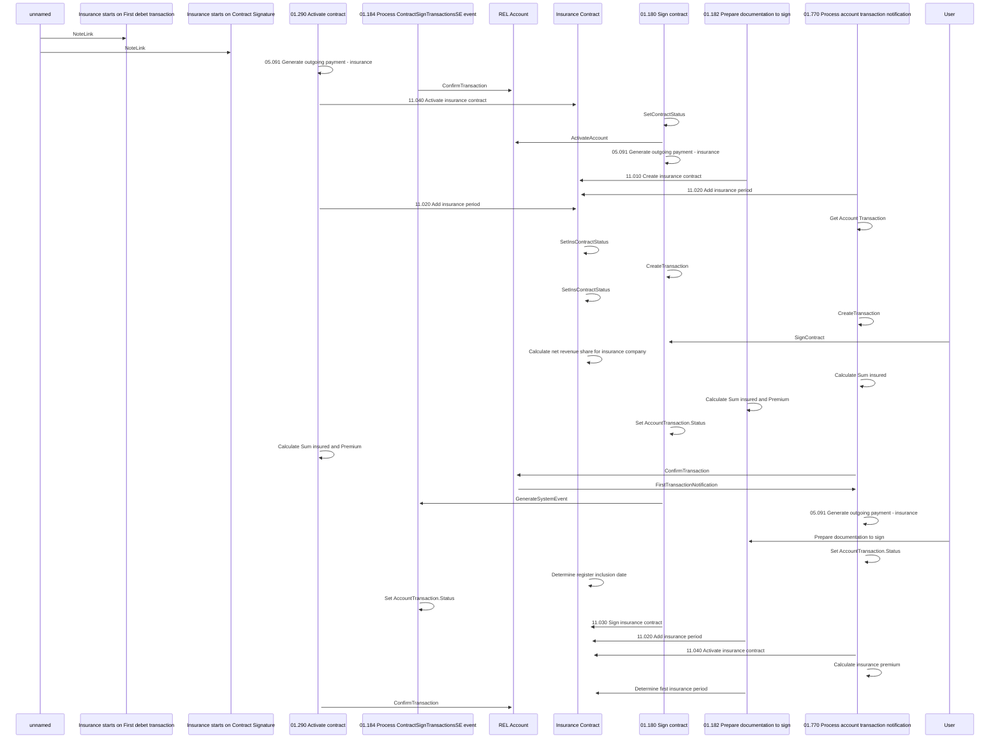

# Insurance based on Contract signature or First Tx

- **Diagram Type**: Sequence
- **Package**: HomerSelect/BSL/Analysis Model/Insurance/Insurance Contract/REL Insurance features/Insurance based on Contract signature or First Tx
- **Diagram ID**: 161877
- **Elements**: 17
- **Connectors**: 36

