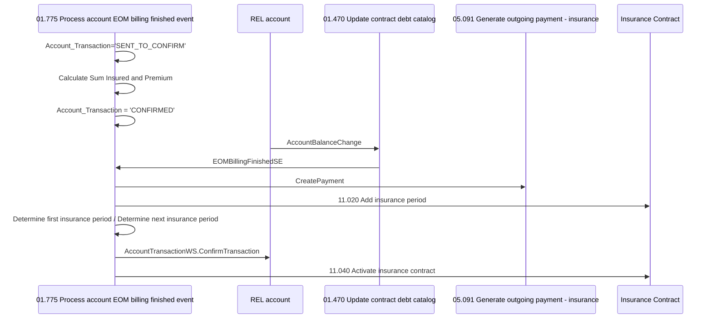

# Insurance based on EOM event

```mermaid
sequenceDiagram
    participant n_01_775_Process_account_EOM_billing_finished_event as 01.775 Process account EOM billing finished event
    participant REL_account as REL account
    participant n_01_470_Update_contract_debt_catalog as 01.470 Update contract debt catalog
    participant n_05_091_Generate_outgoing_payment_insurance as 05.091 Generate outgoing payment - insurance
    participant Insurance_Contract as Insurance Contract
    n_01_775_Process_account_EOM_billing_finished_event->>n_01_775_Process_account_EOM_billing_finished_event: Account_Transaction='SENT_TO_CONFIRM'
    n_01_775_Process_account_EOM_billing_finished_event->>n_01_775_Process_account_EOM_billing_finished_event: Calculate Sum Insured and Premium
    n_01_775_Process_account_EOM_billing_finished_event->>n_01_775_Process_account_EOM_billing_finished_event: Account_Transaction = 'CONFIRMED'
    REL_account->>n_01_470_Update_contract_debt_catalog: AccountBalanceChange
    n_01_470_Update_contract_debt_catalog->>n_01_775_Process_account_EOM_billing_finished_event: EOMBillingFinishedSE
    n_01_775_Process_account_EOM_billing_finished_event->>n_05_091_Generate_outgoing_payment_insurance: CreatePayment
    n_01_775_Process_account_EOM_billing_finished_event->>Insurance_Contract: 11.020 Add insurance period
    n_01_775_Process_account_EOM_billing_finished_event->>n_01_775_Process_account_EOM_billing_finished_event: Determine first insurance period / Determine next insurance period
    n_01_775_Process_account_EOM_billing_finished_event->>REL_account: AccountTransactionWS.ConfirmTransaction
    n_01_775_Process_account_EOM_billing_finished_event->>Insurance_Contract: 11.040 Activate insurance contract
```
