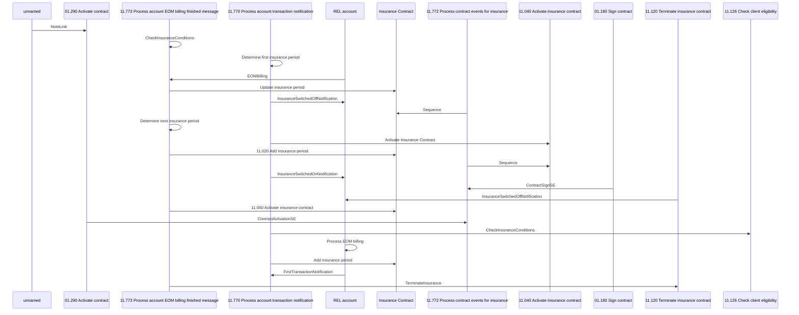

# Insurance based on EOM message

```mermaid
sequenceDiagram
    participant unnamed as unnamed
    participant n_01_290_Activate_contract as 01.290 Activate contract
    participant n_11_773_Process_account_EOM_billing_finished_message as 11.773 Process account EOM billing finished message
    participant n_11_770_Process_account_transaction_notification as 11.770 Process account transaction notification
    participant REL_account as REL account
    participant Insurance_Contract as Insurance Contract
    participant n_11_772_Process_contract_events_for_insurance as 11.772 Process contract events for insurance
    participant n_11_040_Activate_insurance_contract as 11.040 Activate insurance contract
    participant n_01_180_Sign_contract as 01.180 Sign contract
    participant n_11_120_Terminate_insurance_contract as 11.120 Terminate insurance contract
    participant n_11_126_Check_client_eligibility as 11.126 Check client eligibility 
    unnamed->>n_01_290_Activate_contract: NoteLink
    n_11_773_Process_account_EOM_billing_finished_message->>n_11_773_Process_account_EOM_billing_finished_message: CheckInsuranceConditions
    n_11_770_Process_account_transaction_notification->>n_11_770_Process_account_transaction_notification: Determine first insurance period
    REL_account->>n_11_773_Process_account_EOM_billing_finished_message: EOMBilling
    n_11_773_Process_account_EOM_billing_finished_message->>Insurance_Contract: Update insurance period
    n_11_770_Process_account_transaction_notification->>REL_account: InsuranceSwitchedOffNotification
    n_11_772_Process_contract_events_for_insurance->>Insurance_Contract: Sequence
    n_11_773_Process_account_EOM_billing_finished_message->>n_11_773_Process_account_EOM_billing_finished_message: Determine next insurance period
    n_11_770_Process_account_transaction_notification->>n_11_040_Activate_insurance_contract: Activate Insurance Contract
    n_11_773_Process_account_EOM_billing_finished_message->>Insurance_Contract: 11.020 Add insurance period
    n_11_772_Process_contract_events_for_insurance->>n_11_040_Activate_insurance_contract: Sequence
    n_11_770_Process_account_transaction_notification->>REL_account: InsuranceSwitchedOnNotification
    n_01_180_Sign_contract->>n_11_772_Process_contract_events_for_insurance: ContractSignSE
    n_11_120_Terminate_insurance_contract->>REL_account: InsuranceSwitchedOffNotification
    n_11_773_Process_account_EOM_billing_finished_message->>Insurance_Contract: 11.040 Activate insurance contract
    n_01_290_Activate_contract->>n_11_772_Process_contract_events_for_insurance: ContractActivationSE
    n_11_770_Process_account_transaction_notification->>n_11_126_Check_client_eligibility: CheckInsuranceConditions
    REL_account->>REL_account: Process EOM billing
    n_11_770_Process_account_transaction_notification->>Insurance_Contract: Add insurance period
    REL_account->>n_11_770_Process_account_transaction_notification: FirstTransactionNotification
    n_11_773_Process_account_EOM_billing_finished_message->>n_11_120_Terminate_insurance_contract: TerminateInsurance
```
