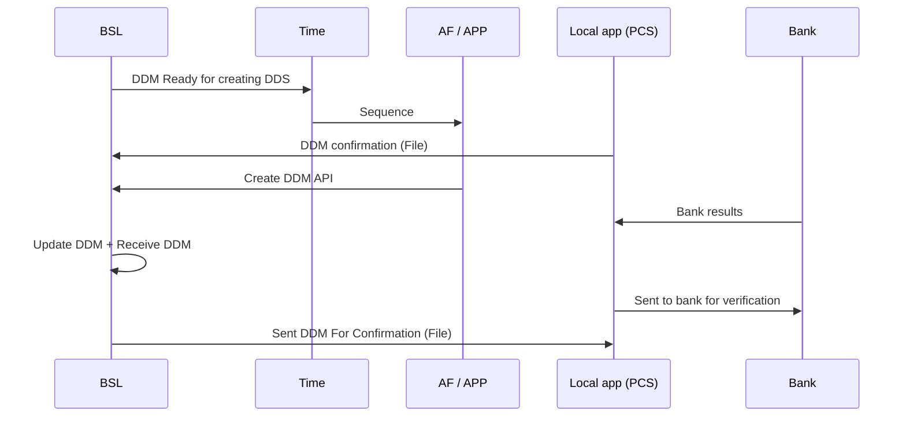

# Direct Debit - DDM Flow

```mermaid
sequenceDiagram
    participant BSL as BSL
    participant Time as Time
    participant AF_APP as AF / APP
    participant Local_app_PCS as Local app (PCS)
    participant Bank as Bank
    BSL->>Time: DDM Ready for creating DDS
    Time->>AF_APP: Sequence
    Local_app_PCS->>BSL: DDM confirmation (File)
    AF_APP->>BSL: Create DDM API
    Bank->>Local_app_PCS: Bank results
    BSL->>BSL: Update DDM + Receive DDM
    Local_app_PCS->>Bank: Sent to bank for verification
    BSL->>Local_app_PCS: Sent DDM For Confirmation (File)
```
