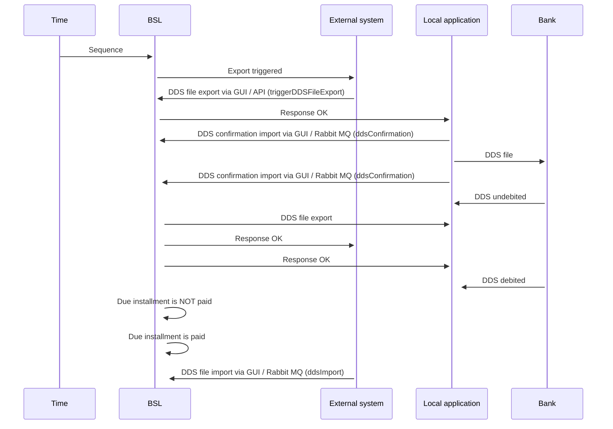

# Direct debit statements

- **Diagram Type**: Sequence
- **Package**: HomerSelect/BSL/Analysis Model/Payments/Direct Debit Statements/Interaction diagrams
- **Diagram ID**: 155684
- **Elements**: 6
- **Connectors**: 15

