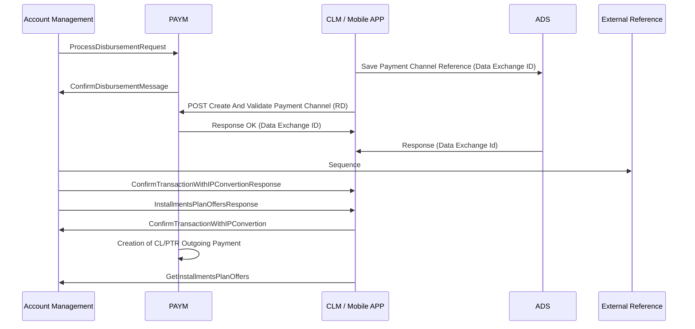

# Create RD Payment Channels (RPD/RCD)

```mermaid
sequenceDiagram
    participant Account_Management as Account Management
    participant PAYM as PAYM
    participant CLM_Mobile_APP as CLM / Mobile APP
    participant ADS as ADS
    participant External_Reference as External Reference
    Account_Management->>PAYM: ProcessDisbursementRequest
    CLM_Mobile_APP->>ADS: Save Payment Channel Reference (Data Exchange ID)
    PAYM->>Account_Management: ConfirmDisbursementMessage
    CLM_Mobile_APP->>PAYM: POST Create And Validate Payment Channel (RD)
    PAYM->>CLM_Mobile_APP: Response OK (Data Exchange ID)
    ADS->>CLM_Mobile_APP: Response (Data Exchange Id)
    Account_Management->>External_Reference: Sequence
    Account_Management->>CLM_Mobile_APP: ConfirmTransactionWithIPConvertionResponse
    Account_Management->>CLM_Mobile_APP: InstallmentsPlanOffersResponse
    CLM_Mobile_APP->>Account_Management: ConfirmTransactionWithIPConvertion
    PAYM->>PAYM: Creation of CL/PTR Outgoing Payment
    CLM_Mobile_APP->>Account_Management: GetInstallmentsPlanOffers
```
