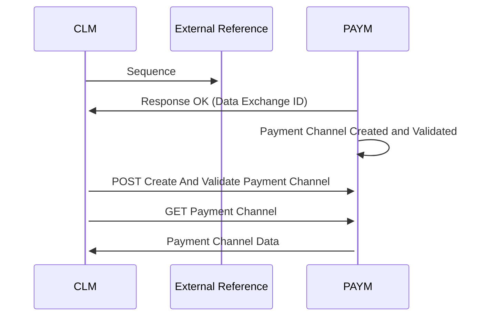

# Create RD Payment Channels

- **Diagram Type**: Sequence
- **Package**: HomerSelect/BSL/Analysis Model/Payments/Payment Channels Management/Interaction Diagrams
- **Diagram ID**: 162512
- **Elements**: 4
- **Connectors**: 6

