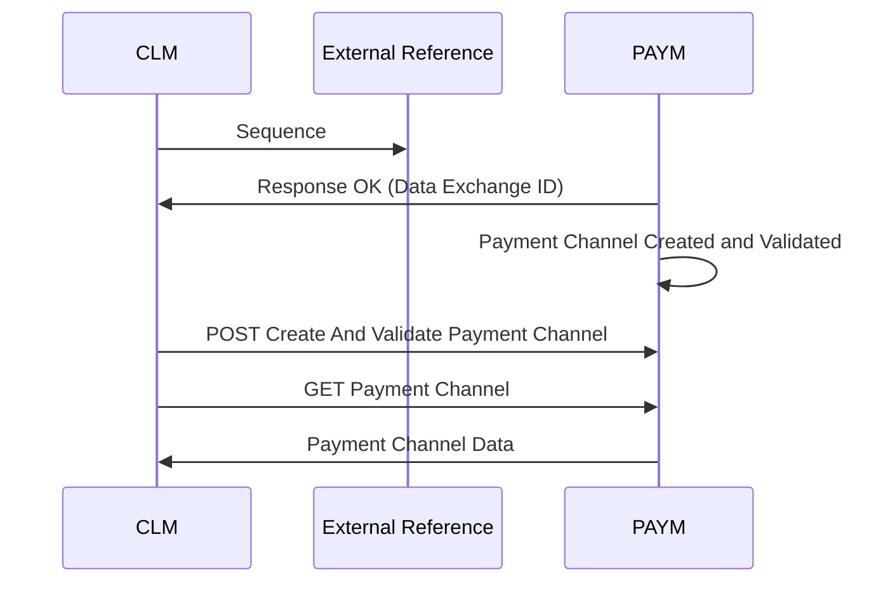

# Create RD Payment Channels

```mermaid
sequenceDiagram
    participant CLM as CLM
    participant External_Reference as External Reference
    participant PAYM as PAYM
    CLM->>External_Reference: Sequence
    PAYM->>CLM: Response OK (Data Exchange ID)
    PAYM->>PAYM: Payment Channel Created and Validated
    CLM->>PAYM: POST Create And Validate Payment Channel
    CLM->>PAYM: GET Payment Channel
    PAYM->>CLM: Payment Channel Data
```
